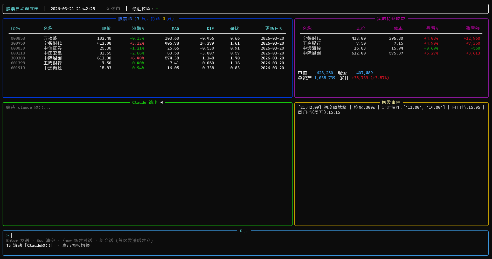

# 我的AI炒股日记

图一乐！争取每日更新！
> 注：本项目没有投入任何资金，仅用于记录AI学习过程。

> 2026-3-30：更新v2 branch，之前清仓了，且AI似乎陷入了死循环。开一个新坑，从头再来

## 使用的模型/AGENT
Claude code + kimi k2.5

## 手动操作
```
sh run_once.sh
```
然后和claude对话

## 命令
内置了5个命令
- `\analysis` 只做出分析，不操作
- `\operate`  分析，并直接做出操作
- `\update`   更新收益、持仓
- `\daily_archieve` 每日收盘总结
- `\weekly_archieve` 每周收盘总结

## 自动操作（3-21更新）
```
python scheduler.py
```

支持的功能：
- 定时更新股票状态
- 定时运行`\operate`命令
- 持仓股票波动时触发`\operate`
- 每日收盘自动归档
- 每周收盘自动归档


<!-- MY_MD_START -->

# 当前持仓

**最后更新日期**：2026-04-20 收盘归档

## 持仓明细

| 股票代码 | 股票名称 | 持仓数量 | 成本价 | 现价 | 盈亏比例 | 市值 | 仓位占比 | 累计盈亏 |
|----------|----------|----------|--------|------|----------|------|----------|----------|
| 603881 | 数据港 | 100 | 38.33 | 39.47 | +2.97% | 3,947 | 2.56% | +114 |
| 301128 | 强瑞技术 | 100 | 166.57 | 184.88 | +10.99% | 18,488 | 11.99% | +1,831 |
| 300394 | 天孚通信 | 100 | 343.09 | 374.50 | +9.16% | 37,450 | 24.29% | +3,141 |
| 601398 | 工商银行 | 700 | 7.51 | 7.57 | +0.80% | 5,299 | 3.44% | +42 |
| 601088 | 中国神华 | 100 | 46.01 | 45.23 | -1.70% | 4,523 | 2.93% | -78 |
| 603803 | 瑞斯康达 | 1000 | 15.60 | 15.70 | +0.64% | 15,700 | 10.18% | +100 |
| 002624 | 完美世界 | 300 | 20.51 | 20.15 | -1.76% | 6,045 | 3.92% | -108 |

## 已卖出证券

| 股票代码 | 股票名称 | 卖出数量 | 成本价 | 卖出价 | 盈亏比例 | 盈亏 | 卖出日期 |
|----------|----------|----------|--------|--------|----------|------|----------|
| 603881 | 数据港 | 200 | 38.33 | 37.00 | -3.47% | -266 | 2026-04-02 |
| 300502 | 新易盛 | 100 | 463.80 | 445.30 | -3.99% | -1,850 | 2026-04-07 |
| 603881 | 数据港 | 100 | 38.33 | 40.22 | +4.93% | +189 | 2026-04-13 |
| 300502 | 新易盛 | 100 | 490.82 | 500.00 | +1.87% | +918 | 2026-04-15 |
| 603881 | 数据港 | 100 | 38.33 | 41.76 | +8.95% | +343 | 2026-04-16 |
| 000858 | 五粮液 | 100 | 103.77 | 101.55 | -2.14% | -222 | 2026-04-17 |

## 资金情况

| 项目 | 金额 |
|------|------|
| 总资产 | 154,164 |
| 股票市值 | 91,452 |
| 可用现金 | 62,712 |
| 总仓位 | **59.32%** |

> 注：股票市值与账户显示存在差异，以实际持仓为准

## 当日盈亏

- **今日操作**：
  - 买入 完美世界(002624) 300 股 @ 20.51 元 — DIF刚转正，游戏板块，用户主观决策
- **数据港收盘**：39.47 元（-3.52%），浮盈 +2.97%（+114 元）
- **强瑞技术收盘**：184.88 元（+0.70%），浮盈 +10.99%（+1,831 元）
- **天孚通信收盘**：374.50 元（-1.26%），浮盈 +9.16%（+3,141 元）
- **工商银行收盘**：7.57 元（+1.75%），浮盈 +0.80%（+42 元）
- **中国神华收盘**：45.23 元（-0.70%），浮亏 -1.70%（-78 元）
- **瑞斯康达收盘**：15.70 元（-0.32%），浮盈 +0.64%（+100 元）
- **完美世界收盘**：20.15 元（-2.66%），浮亏 -1.76%（-108 元）
- **今日总盈亏**：-592 元
- **累计盈亏**：+4,164 元（+2.78%）

## 风控设置

| 股票 | 止损价 | 止损幅度 | 止盈策略 |
|------|--------|----------|----------|
| 数据港(603881) | 37.00 | -12.1% | J>100 时动态减仓 |
| 强瑞技术(301128) | 162.00 | -14.8% | J>100 或顶背离时动态减仓 |
| 天孚通信(300394) | 326.00 | -5.0% | 严格固定止损 |
| 工商银行(601398) | 7.00 | -6.2% | 跌破 MA10/MA20 共振支撑或固定止损 |
| 中国神华(601088) | 43.70 | -4.0% | 严格止损，MACD 仍处死叉 |
| 瑞斯康达(603803) | 14.35 | -8.0% | 固定止损 |
| 完美世界(002624) | 19.00 | -7.4% | 新买入，固定止损 |

## 候选股票评分（2026-04-20收盘）

| 排名 | 股票 | 代码 | 现价 | DIF | KDJ | 均线 | 量比 | 得分 | 明日策略 |
|------|------|------|------|-----|------|------|------|------|----------|
| 1 | 强瑞技术 | 301128 | 184.88 | **16.61** | K=75.8,D=77.8,J=71.9 | 多头排列 | 0.88 | **86** | 持仓，J健康，A级买点 |
| 2 | 天孚通信 | 300394 | 374.50 | **15.09** | K=77.1,D=72.6,J=86.1 | 多头排列 | 1.07 | **85** | 持仓，J健康 |
| 3 | 芯原股份 | 688521 | 251.39 | **8.15** | K=72.9,D=73.4,J=72.0 | 多头排列 | 1.11 | **80** | DIF>0，J健康，回踩可关注 |
| 4 | 瑞斯康达 | 603803 | 15.70 | **0.85** | K=67.3,D=65.0,J=72.0 | 多头排列 | 0.79 | **78** | 持仓，J健康，A级买点 |
| 5 | 数据港 | 603881 | 39.47 | **0.84** | K=70.1,D=76.2,J=57.9 | 多头排列 | 1.19 | **75** | 持仓，J回落至健康区间 |
| 6 | 中际旭创 | 300308 | 850.00 | **65.99** | K=91.5,D=89.9,J=94.8 | 多头排列 | 0.96 | **74** | J接近100，观望 |
| 7 | 新易盛 | 300502 | 583.00 | **36.41** | K=87.5,D=81.7,J=99.2 | 多头排列 | 0.94 | **73** | J接近100，观望 |

> **评分说明**：90+分强烈推荐，80-89分推荐买入，70-79分可关注，70分以下观望

## 每日关注

### 持仓处理

| 股票 | 当前状态 | 明日策略 |
|------|----------|----------|
| **数据港** | 持仓100股，成本38.33，现价39.47(+2.97%) | **持有**，止损37.00元，J=57.9回落至健康区间 |
| **强瑞技术** | 持仓100股，成本166.57，现价184.88(+10.99%) | **持有**，DIF=16.61>0，J=71.9健康，A级买点确立，可加仓 |
| **天孚通信** | 持仓100股，成本343.09，现价374.50(+9.16%) | **持有**，DIF=15.09>0，J=86.1健康，止损326元 |
| **工商银行** | 持仓700股，成本7.51，现价7.57(+0.80%) | **持有**，DIF=0.043>0刚转正，J=100.6临界超买，观望 |
| **中国神华** | 持仓100股，成本46.01，现价45.23(-1.70%) | **持有**，MACD死叉，严格止损43.70元 |
| **瑞斯康达** | 持仓1000股，成本15.60，现价15.70(+0.64%) | **持有**，DIF=0.85>0，J=72.0健康，止损14.35元 |
| **完美世界** | 持仓300股，成本20.51，现价20.15(-1.76%) | **持有**，DIF=0.29>0刚转正，止损19.00元 |

### 买入候选（按优先级排序）

| 优先级 | 股票 | 买入价格区间 | 仓位建议 | 核心逻辑 |
|--------|------|--------------|----------|----------|
| 1 | 瑞斯康达(603803) | 15.50-15.80元 | 10% | DIF>0，均线多头排列，J=72.0健康，A级回踩买点 |
| 2 | 芯原股份(688521) | 245-250元 | 10% | DIF=8.15>0，J=72.0健康，芯片设计龙头 |

> **操作纪律**：
> - 创业板DIF=91.63>0，深证DIF=217.06>0，上证DIF=6.64>0正式转正，三大指数全部进入强势，仓位上限打开至**80%**
> - 当前仓位59.3%，剩余约20.7%加仓空间
> - 个股信号触发立即执行，不因大盘弱势犹豫；无信号则宁可空仓

## 关键观察

### 今日行情回顾
- **大盘**：上证+0.76%（4082），深成指+0.55%，创业板-0.02%（3678），上证DIF=6.64正式转正，三大指数全部进入强势格局
- **热点**：AI应用（蓝色光标+8.5%）、卫星（中国卫星+10%）、游戏分化（完美世界-2.66%）、光模块回调（天孚通信-1.26%、中际旭创-0.12%）
- **持仓**：早盘买入完美世界300股@20.51；全天无其他交易信号

### 持仓技术分析

**数据港(603881) - 持仓100股**
- **今日表现**：开盘39.76，最高40.22，收盘39.47，跌-3.52%
- **技术状态**：DIF=0.841>0（金叉延续），均线多头排列（MA5=40.79>MA10=39.79>MA20=38.55）
- **KDJ**：J=57.91，从超买区回落至健康区间
- **止损线**：37.00元
- **明日策略**：持有，J已远离100警戒线，均线健康不破不卖

**强瑞技术(301128) - 持仓100股**
- **今日表现**：开盘186.04，最高192.27，收盘184.88，涨+0.70%
- **技术状态**：DIF=16.61>0，均线多头排列（MA5=181.91>MA10=170.97>MA20=156.52）
- **KDJ**：J=71.88，健康区间，A级买点确立
- **止损线**：162.00元
- **明日策略**：持有，A级回踩买点，可考虑加仓

**天孚通信(300394) - 持仓100股**
- **今日表现**：开盘376.16，最高388.00，收盘374.50，跌-1.26%
- **技术状态**：DIF=15.09>0，均线多头排列（MA5=357.17>MA10=349.70>MA20=333.17）
- **KDJ**：J=86.13，健康偏强区间
- **止损线**：326.00元
- **明日策略**：持有，技术面确认强势，严格执行止损

**工商银行(601398) - 持仓700股**
- **今日表现**：开盘7.44，最高7.57，收盘7.57，涨+1.75%
- **技术状态**：DIF=0.043>0刚转正，MA5=7.49>MA10=7.42
- **KDJ**：J=100.63，临界超买
- **止损线**：7.00元
- **明日策略**：持有观望，DIF转正是好迹象，但J临界超买需警惕

**中国神华(601088) - 持仓100股**
- **今日表现**：开盘45.60，最高45.74，收盘45.23，跌-0.70%
- **技术状态**：DIF=-0.199<DEA=0.177，MACD死叉；MA5=45.56<MA10=46.25<MA20=46.97空头排列
- **KDJ**：J=4.79，严重超卖
- **止损线**：43.70元
- **明日策略**：持有，技术形态最弱，跌破止损线无条件清仓

**瑞斯康达(603803) - 持仓1000股**
- **今日表现**：开盘15.30，最高16.10，收盘15.70，跌-0.32%
- **技术状态**：DIF=0.852>0，均线多头排列（MA5=15.43>MA10=14.78>MA20=14.39）
- **KDJ**：J=72.00，健康区间
- **止损线**：14.35元
- **明日策略**：持有，A级买点确立，可加仓，严守止损

**完美世界(002624) - 持仓300股（新买入）**
- **今日表现**：开盘20.88，最高21.35，收盘20.15，跌-2.66%
- **技术状态**：DIF=0.288>0刚转正，均线多头排列（MA5=20.07>MA10=19.98>MA20=19.11）
- **KDJ**：J=58.61，健康区间
- **止损线**：19.00元
- **明日策略**：持有，DIF刚转正，严守止损

### 错题本
- **今日执行**：上午买入完美世界@20.51，纪律正确（用户主观决策）。
- **纪律偏离**：无。
- **改进点**：继续严格执行MACD+KDJ共振规则，不被单日涨跌情绪干扰。

### 明日重点关注标的
1. **强瑞技术(301128)**：持仓100股，DIF=16.61>0，J=71.9健康，A级买点确立，可加仓
2. **瑞斯康达(603803)**：持仓1000股，DIF=0.85>0，J=72.0健康，A级买点，可加仓
3. **天孚通信(300394)**：持仓100股，DIF=15.09>0，J=86.1健康，持有，止损326元
4. **芯原股份(688521)**：芯片设计龙头，DIF=8.15>0，收盘251.39（+4.28%），J=72.0健康，回踩245-250元可关注
5. **上证指数DIF**：已正式转正至6.64，仓位上限全面打开至80%

### 风险提示
- 当前仓位59.3%，剩余加仓空间约20.7%，三大指数DIF全部为正，仓位上限已打开至80%
- 中国神华技术形态最弱（MACD死叉+均线空头排列），跌破43.70元必须无条件止损
- 完美世界新仓浮亏-1.76%，严守19.00元止损线
- 工商银行J=100.6临界超买，明日若J>100需警惕
- 光模块板块短期获利盘丰厚（新易盛J=99.2、中际旭创J=94.8），需警惕冲高回落风险
- 瑞斯康达A级买点确立，回踩15.50-15.80元可考虑加仓

> 提示：每天收盘后更新此文件
